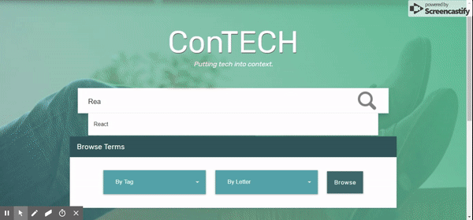

# ConTECH
__Putting Tech into context.__ A Developer’s Dictionary and Interactive Reference Guide.

#### Overview:
* The inspiration behind this project came from our experience when beginning UNCC’s Coding Bootcamp. 
* If we searched for an unfamiliar term online, we could easily find ourselves inundated with vast amounts of information.
* We found that it wasn’t just developers that ran into this issue, but also those that worked with developers.
* __Our app is a quick reference tool that provides simplified definitions to these complex terms.__
* __Our app is for developers, those that work with developers, or anyone that is new to the industry.__

#### Live Link: [Click me!](https://contech-app.herokuapp.com/)

#### Test Accounts 

1. Admin Level
    * Email: testAdmin@gmail.com
    * Password: password
1. User Level
    * Email: testUser@gmail.com
    * Password: password

#### Video Walkthrough

__Here is a video of a brief walkthrough of Contech__

[Contech Youtube Walkthrough]()

#### _Contributors:_ 
__Alexander Bradley__ | __Daniel Doyle__ | __Brad Ferrell__ | __Abby Olaleye__